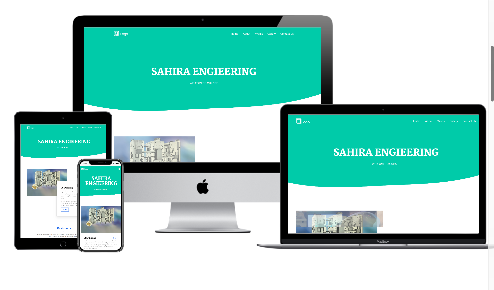

# sahira_engineering# Ma-Engineering

It is an original website.It is Made with HTML, CSS ,Bootstrap and javascript . The website uses the Bootstrap grid system as well as media queries to achieve responsiveness. Additionally, there is the use of industry-standard tools (flexbox) to palce elements in this page.

            

## Built With

- HTML
- CSS
- Bootstrap
- Javascript

## Live Demo

[Live Demo Link](https://rawcdn.githack.com/sumon0002001/sahira_engineering/21b350286fcd488b89ce964c1b649a575262964d/index.html)

## Getting Started

To get a local copy up and running follow these simple example steps.

### Prerequisites

- A operating system such as Windows, MAC, or Linux
- A modern browser such as Google Chrome, Mozilla Firefox, or Microsoft Edge

### Setup
- Clone or download the repo and run the HTML File.

### Run tests
- StyleLint
- Webhint
- Lighthouse

## Authors

👤 **Mir Rawshan Ali**

- GitHub: [@sumon0002009](https://github.com/sumon0002001)
- Twitter: [@sumon0002009](https://twitter.com/Sumon0002009)
- LinkedIn: [Mir Rawshan Ali](https://www.linkedin.com/in/mir-rawshan-ali-27b6a5198/)

## 🤝 Contributing

Contributions, issues, and feature requests are welcome!

Feel free to check the [issues page]

## Show your support

Give a ⭐️ if you like this project!

